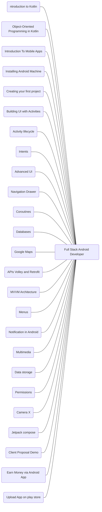

# Full Stack Android Developer

#### Introduction to Kotlin
1. Introduction to Kotlin and its Advantages
1. Basic syntax and data types
1. Variables and constants
1. Control flow statements (if/else, for, while)
1. Functions and lambdas

#### Object-Oriented Programming in Kotlin
1. Classes and objects
1. Inheritance and interfaces
1. Visibility modifiers
1. Extension functions and properties
1. Null safety and handling nulls
1. Collections and functional programming
1. Generics and type variance
1. Interoperability with Java

#### Introduction To Mobile Apps  
1. Why We Need Mobile Apps
1. Introduction of Mobile Apps  
1. Different Kinds of Mobile Apps
1. Importance of Apps

#### Installing Android Machine
1. Setting up Android Studio  
1. Set Up with SDK in Android Studio  
1. Introduction of Android Studio

#### Creating your first project
1. Hello World App  
1. The manifest files  
1. Layout resource
1. Hello World App
1. Run your app on Emulator / Phone

#### Building UI with Activities
1. Activities  
1. Views, layouts, and Common UI components  
1. Creating UI through code and XML  
1. Constraint Layout
1. Responsive Layouts

#### Activity lifecycle
1. Important Activity Lifecycle Methods
 
#### Intents
1. Communicating data among Activities  
1. Intent Types (Implicit and Explicit Intent)
1. Broadcast Receivers and Services

#### Advanced UI
1. Selection components (GridView, Spinner, Recycler View)  
1. View binding 
1. Adapters, Custom Adapters  
1. Complex UI components  
1. Building UI for performance   
1. Toast, Custom Toast  Dialogs  
1. Convert Website into App  
1. Fragments 

#### Navigation Drawer 
1. ND with Fragment

### Advanced Topics
#### Coroutines 
1. Basics
1. Suspend
1. Dagger

#### Databases 
1. Online Database Firebase  
1. Offline Database Room

#### Google Maps
1. Using Location-Based Services
1. Working with Google Maps
1. Showing Google map in an Activity  
1. Displaying route on the map  
1. Finding the current location and listening for changes in the location

#### APIs (Volley and Retrofit)
1. Develop API  
1. Test API  
1. Use API in Android App  
1. Develop Complete Android App using API

#### MVVM Architecture	
1. Understanding of architecture components
1. Data binding
1. ViewModel provider
1. Live data
1. Room database

#### Menus
1. Option menu
1. Popup menu
1. Context menu

#### Notification in Android
1. FCM notification
1. One signal notification

#### Multimedia
1. Audio files
1. Video files
1. Music player app  Project

#### Data storage
1. Firebase Storage
1. Shared preferences
1. Android file system

#### Permissions
1. Varieties of persimmon in android
1. How to add permission to the app
1. How do you ask for run time permission

#### Camera X
1. Master class on Camera X

#### Jetpack compose
1. Xml vs jetpack compose
1. Jetpack components
1. Row
1. Column
1. Box and card
1. Designing Cool UI with compose
1. MVVM with compose
1. State management in compose 
1. State hosting 
1. Stateful and stateless composable
1. Clean architecture Using compose -> Extended version of Mvvm
1. Paging 3 
1. Media3 in compose
1. Dependency injection jetpack compose

#### Client Proposal Demo
1. How to refer Figma
1. How to convert Figma design to the Client app

	

#### Earn Money via Android App
1. Implement Google Ads in the app  
1. All ways to earn money using an Android App
1. Freelancing
1. How to Look for A job (Interview Questions)

#### Upload App on play store 
1. Buy Play Console Account
1. Publish the App on Google Play Console

|[Roadmap](https://www.figma.com/file/a0AyeWQAz3VtOWfoY5SzqW/Android-Development-Roadmap?type=design&node-id=0%3A1&mode=design&t=oFosRnomAN09nBVT-1)|
|---|