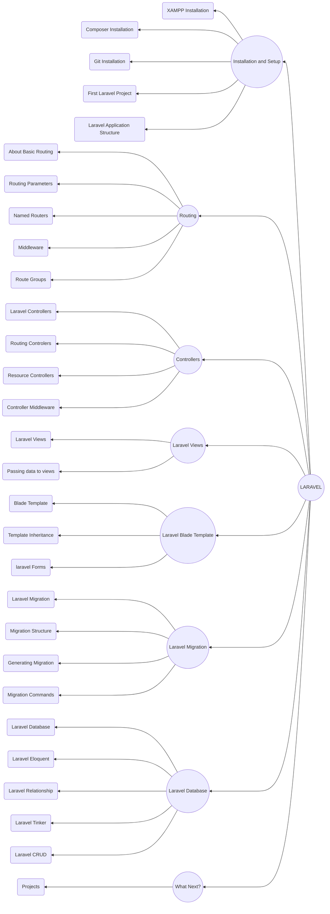

# PHP-Laravel

## PHP Roadmap

```mermaid
flowchart LR
    A((PHP)) --> B((Installation and Setup))
    B --> BA(XAMPP)
    B ---> BB(File Setup)

    A ---> C((Introduction to PHP))
    C ---> CA(Echo, Print)
    C ---> CB(Variable,Variable Scope)
    C ---> CC(Constants)
    C ---> CD(Data Types)
    C ----> CE(Operators)
    C ---> CF(Comments)
    C ---> CG(PHP Keywords)

   CE --->CEA(Arithmetic Operators)
   CE --->CEB(Assignmment Operators)
   CE --->CEC(Bitwise Operators)
   CE --->CED(Comparison Operators)
   CE --->CEE(Increment/Decrement Operators)
   CE --->CEF(logical Operators)
   CE --->CEG(String Operators)
   CE --->CEH(Array Operators)
   CE --->CEI(Type Operators)
   CE --->CEJ(Execution Operators)
   CE --->CEK(Error Control Operators)

   A ---> D((Control Statement))
   D ---> DA(If Else)
   D ---> DB(Switch)
   D ---> DC(For Loop)
   D ---> DD(While Loop)
   D ---> DE(Do While Loop)
   D ---> DF(Break)
   D ---> DG(Continue)

   A ---> E((Arrays))
   E ---> EA(Array)
   E ---> EB(Indexed Array)
   E ---> EC(Associative Array)
   E ---> ED(Multidimensional Array)
   E ---> EE(Array Functions)

   A ---> F((Functions))
   F ---> FA(Functions)
   F ---> FB(Call By Value)
   F ---> FC(Call By Reference)
   F ---> FD(Default Arguments)
   F ---> FE(Variable Arguments)
   F ---> FF(Recursive Function)

   A ---> G((Strings))
   G ---> GA(String)
   G ---> GB(String Functions)

   A ---> H((Math))
   H ---> HA(Math Functions)

   A ---> I((PHP Form))
   I ---> IA(Form Handling)
   I ---> IB(Form Validation)
   I ---> IC(Form Required)
   I ---> ID(Form uRL/E-Mail)
   I ---> IE(Form Complete)
   I ---> IF(Get, Post)

   A ---> J((PHP Advanced))
   J ---> JA(Cookie)
   J ---> JB(Session)
   J ---> JC(Date and Time)
   J ---> JD(Filters)
   J ---> JE(PHP JSON)
   J ---> JF(Exceptions)

   A ---> K((PHP Include))
   K ---> KA(Include & Require)

   A ---> L((File))
   L ---> LA(File Handlinng)
   L ---> LB(Open File)
   L ---> LC(Read  File)
   L ---> LD(Write File)
   L ---> LE(Append File)
   L ---> LF(Delete File)

   A ---> M((Upload/Download))
   M ---> MA(Upload File)
   M ---> MB(Download File)

   A ---> N((OOP))
   N ---> NA(Introduction to OOP)
   N ---> NB(Class/Objects)
   N ---> NC(Constructor)
   N ---> ND(Destructor)
   N ---> NE(Access Modifiers)
   N ---> NF(Inheritance)
   N ---> NG(Abstract Classes)
   N ---> NH(Interfaces)
   N ---> NI(Static Methods)
   N ---> NJ(Static Properties)
   N ---> NK(Namespaces)
   N ---> NL(Traits)
   N ---> NM(Iterables)

   A ---> O((MySQL))
   O ---> OA(MySQL Database)
   O ---> OB(MySQL Connect)
   O ---> OC(MySQL Create DB)
   O ---> OD(MySQL Create Tabel)
   O ---> OE(MySQL Insert Data)
   O ---> OF(MySQL Get ID)
   O ---> OG(MySQL Insert Multiple)
   O ---> OH(MySQL Prepared)
   O ---> OI(MySQL Select Data)
   O ---> OJ(MySQL Where)
   O ---> OK(MySQL Order By)
   O ---> OL(MySQL Delete Data)
   O ---> OM(MySQL Update Data)
   O ---> ON(MySQL Limit Data)

   A ---> P((What Next?))
   P ---> PA(Projects)
   P ---> PB(Laravel)
```

Free Resource Links  ---[⬆️](#php-laravel)---
|Resource|Links|
|---|---|
|PHP|[link](https://www.php.net/)|
|Laravel|[link](https://laravel.com/)|

## Laravel Roadmap

GO-TO ---[⬆️](#php-laravel)---