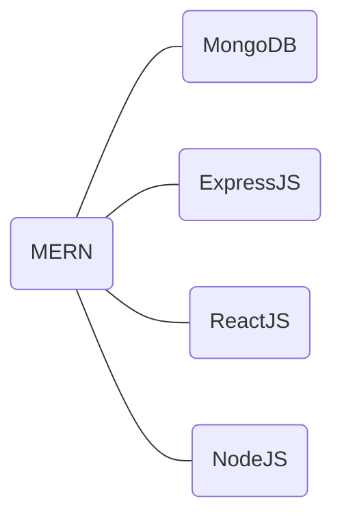

# rodamaps
Discover detailed roadmaps for Python, JavaScript, AI, Java, Data Science, Machine Learning, Django, PHP, Laravel, and more.

#### 1. MERN

#### [MERN](./1.MERN/README.md)

#### 2. FRONTEND
 1. [ReactJS](./2.FRONTEND/React.js.md)
 1. [Vue.js](./2.FRONTEND/Vue.js.md) 
 2. [Angular.js](./2.FRONTEND/Angular.js.md)

#### 5.PHP-Laravel
- [link](./5.Php-Laravel/README.md)

#### 6.C Programming
- [link](./6.C/README.md)

#### 7.C++ Programming
- [link](./7.C++/README.md)

#### 8.Python For AI
- [link](./8.Python%20For%20AI/README.md)

#### 10.C++ with DSA
- [link](./10.DSA%20with%20C++/README.md)